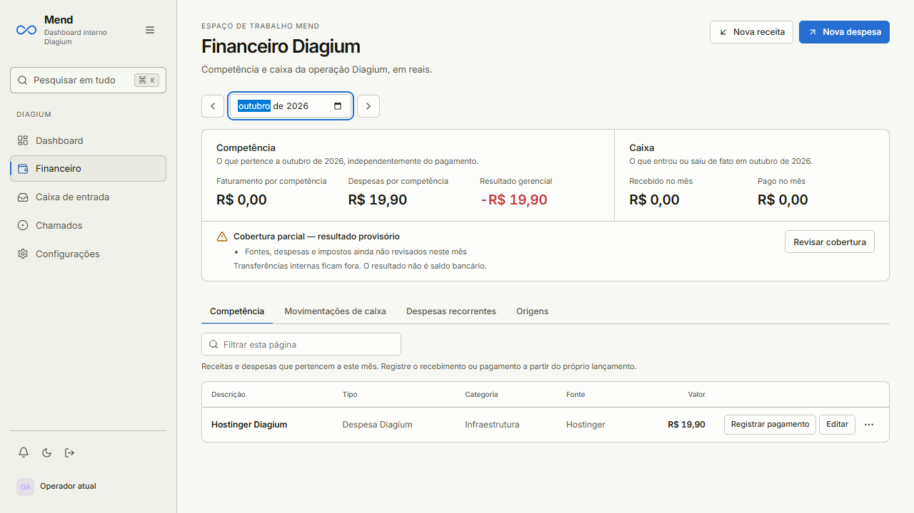
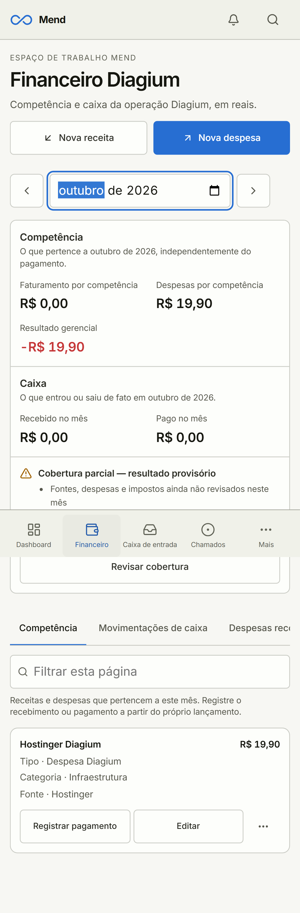
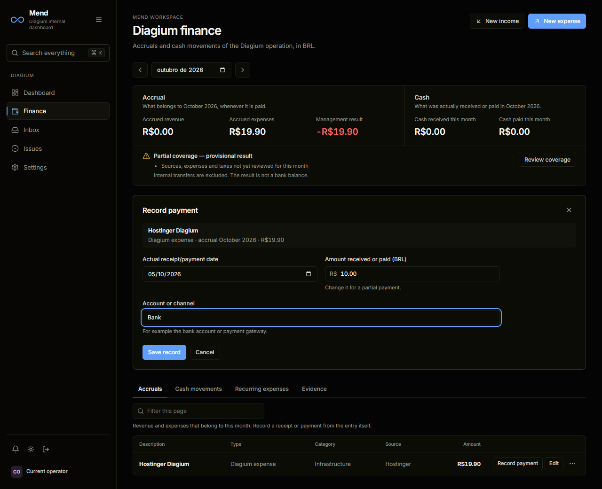

# Finance workflows and navigation review

The financial page now provides separate income/expense actions, payments from
their entry (including partial payments), recurring generation, evidence and
readable audit history. Dashboard uses access and summary only. Existing API,
database, authorization and optimistic version contracts are preserved.

The workspace bootstrap previously restarted after publishing its resolved ID;
the regression observes one initial collection load instead of two. Conversation
snapshots are loaded only in Inbox. Finance summary is independent of ledger tabs;
returning to the route revalidates access before using a user-scoped memory cache.
Delayed responses are discarded after mutation, revocation or account changes.
Different authenticated users remount app state; same-user token refresh retains it.

The interface was implemented with Claude CLI, then reviewed and hardened by Tibo.
There are no new dependencies. Upload code and the finance editor route load on
demand. Initial JavaScript gzip is approximately 313.6 kB (previously 321.3 kB).
The measured saving is modest; no production API latency improvement is claimed.

## Verification

- 762 unit tests passed in 119 files (`vitest run --maxWorkers=4`).
- Full desktop/mobile Playwright suite: 164 passed, 10 skipped, two workers.
- After the final saving/month-review control fixes, 32 focused finance,
  navigation and contrast E2E passed on both viewports.
- Build/typecheck, formatting and internationalization passed.
- Lint: zero errors and three existing warnings.
- Light/dark secondary text contrast passed on all four app surfaces.
- Cached navigation is exercised with a simulated 700 ms response delay;
  this proves frontend behavior, not hosted API performance.

The two final regressions failed before the fix: a new action could replace a
saving draft; coverage review could open while the selected month's summary was
still stale. Actions now disable during those transitions. Conflict recovery,
cancellation and access revocation remain covered.

These screenshots use isolated synthetic financial data. Authenticated HTTP
measurement against the previous production SHA used one temporary QA account,
without ledger writes: five samples per endpoint gave access 1091-1423 ms,
summary 1315-1479 ms, entries 1210-1484 ms and workspace 982-1020 ms.
Small direct PostgREST queries gave 39-103 ms. These paths differ in work and
network route; the samples do not isolate the server/database cause. Grant
revocation returned 403 with the existing JWT. QA sessions, account, membership
and grant were removed; production remained at four members, one channel and
two finance grants. The refactor's visual behavior in production remains pending.

The cache regression now holds the fresh summary response until after cached
figures are visible, rather than relying on a 300 ms wall-clock deadline. Eight
repetitions passed with six workers after independent QA exposed that deadline
as flaky under CPU contention. App behavior is unchanged by this test correction.
Zelo Stripe/AbacatePay integration is a separate pending connection: its current
Admin reads PIX from Supabase but Stripe invoices from the Stripe API.

## Visual evidence

