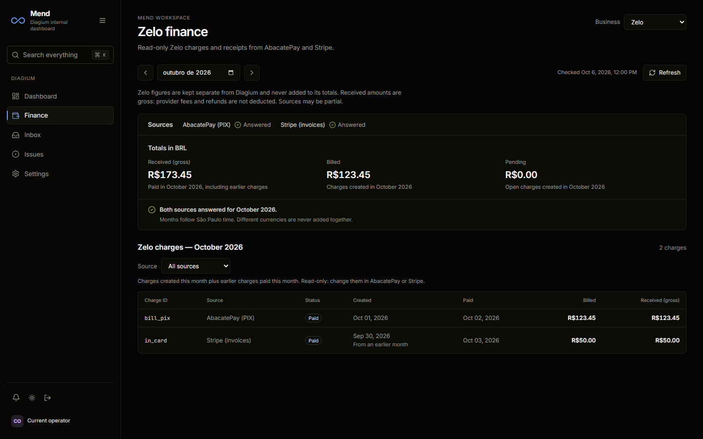
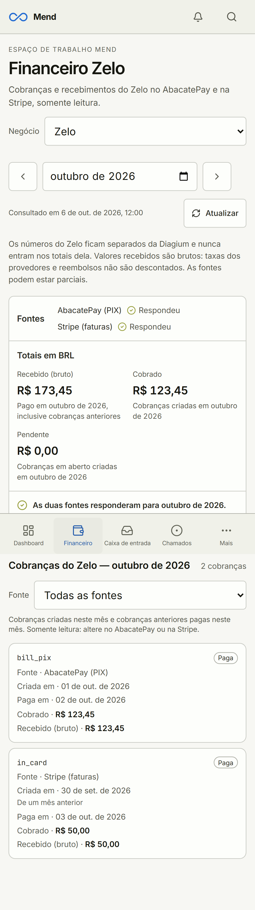

# Zelo finance review — 2026-10-06

The Claude CLI implemented the new read-only Zelo view in session `65fdd1d4-62f5-4361-82c7-f37336d82cf7`. Tibo reviewed the result, coalesced duplicate mount requests, stopped hidden Diagium queries, corrected unknown payment dates, fixed the light-theme paid badge contrast and normalized Stripe zero-decimal currencies. No additional QA bot was invoked, per the user's instruction.

Reviewed at 1440×900 desktop (en-US/dark) and 390×844 mobile (pt-BR/light). Screens use synthetic IDs and amounts, not production customer data:

## Verification

- 775 unit tests in 120 files passed.
- 15 real PostgreSQL financial/security scenarios passed in isolated PGlite.
- Build/typecheck, i18n checks, lint (zero errors; three existing warnings) and format checks passed.
- Full E2E run: 184 passed, 10 skipped; two new pagination tests failed because their locator expected `Next` while the UI uses `Next page`. The locator was corrected.
- Final finance/navigation/Zelo run: 47/48 passed, including all 18 Zelo scenarios and corrected pagination in both viewports. One existing dashboard startup test timed out finding its finance panel; it passed 3/3 isolated reruns. Its intermittent startup timeout is not claimed fixed by this integration.
- Zelo scenarios cover separation from Diagium, pt-BR/en-US, light/dark, source filtering/pagination, unknown paid amounts, missing providers, temporary errors/recovery, revoked access, cached revalidation and month labeling while responses are blocked.
- Real GET-only source checks returned October: two PIX and two Stripe transactions; BRL 207.00 confirmed gross receipts, BRL 99.00 pending charges. September was correctly partial due to missing PIX payment amounts. No production writes, temporary users or provider mutations occurred.

## Activation boundary

The code is prepared for publication; the production connection is **not activated**. The infrastructure owner must configure the two server-side variables in [the connection handoff](../../../engineering/ZELO_FINANCE_CONNECTION.md), deploy the app SHA, and perform an authorized read-only smoke test. Roger is not reachable through Tibo's currently allowed team tools. No secrets were placed in repo files or copied into deployment configuration by this task.
